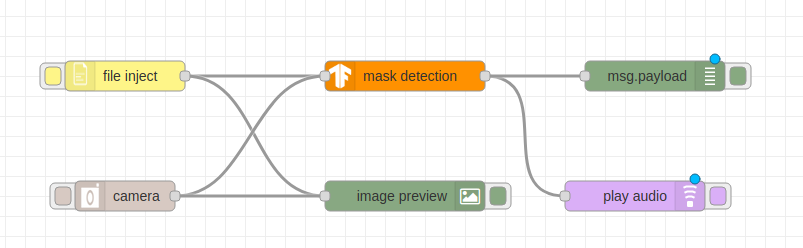

# Developing a Machine Learning IoT App with Node-RED and TensorFlow.js for mask detection

In most cases, enabling your IoT device with AI capabilities involves sending the data from the device to a server. The machine learning calculations would happen on the server. Then the results sent back to the device for appropriate action.

When data security or network connectivity is a concern this is not an ideal or feasible approach.

[Node-RED](https://nodered.org) is an open source visual programming tool that offers a browser-based flow editor for wiring together devices, APIs, and services. Built on Node.js, you can extend its features by creating your own nodes or taking advantage of the JavaScript and NPM ecosystem.

[TensorFlow.js](https://js.tensorflow.org) is an open source JavaScript library to build, train, and run machine learning models in JavaScript environments such as the browser and Node.js.

Combining Node-RED with TensorFlow.js developers and IoT enthusiasts can more easily add machine learning functionality onto their devices.

In this project, a mask detection code is written to be run on 2 different plateforms, raspberry-pi and IBM cloud.

## Flow

1. The user owns or downloads a machine learning model in TensorFlow.js format.
2. The user creates a Node-RED node for the TensorFlow.js model and wires the TensorFlow.js node in a Node-RED application.
3. The user can deploy the Node-RED application locally.
4. The user can access the Node-RED application from a browser and can trigger inferencing on images captured from a webcam.
5. Alternatively, the user can deploy the Node-RED application to a Raspberry Pi.
6. The device runs the Node-RED application and performs inferencing on images from a camera or uploaded image.
7. The device can output to a connected speaker to inform if a person in the image is wearing mask or not.

## Included Components

- [Node-RED](https://nodered.org): A flow-based programming tool for wiring together hardware devices, APIs, and online services
- [TensorFlow.js](https://js.tensorflow.org): A JavaScript library for training and deploying ML models in the browser and on Node.js

## Featured Technologies

- Machine Learning
- IoT
- JavaScript / Node.js

## Steps

Follow these steps to setup and run this code pattern. The steps are described in detail below.

1. clone the repo
2. cd into the project folder
3. run `npm install`
4. run `npm install mask_node`
5. run `npm install @tensorflow/tfjs-node`
6. run `npm install @tensorflow/tfjs-data`
7. run `npm install @tensorflow-models/blazeface`
8. run `npm start`
9. Go to http://127.0.0.1:1880/ in your browser.
10. Add and deploy the flow as shown   

